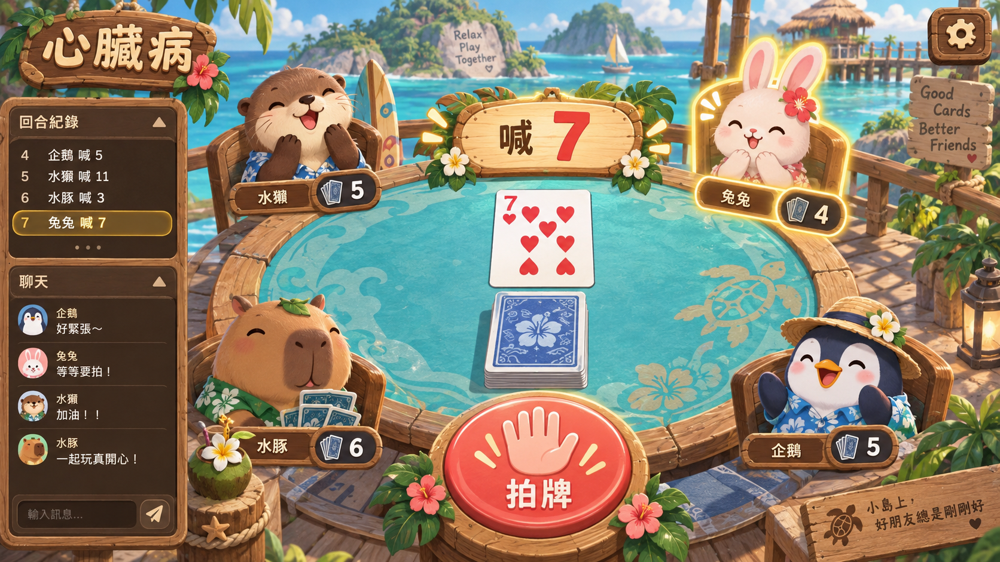
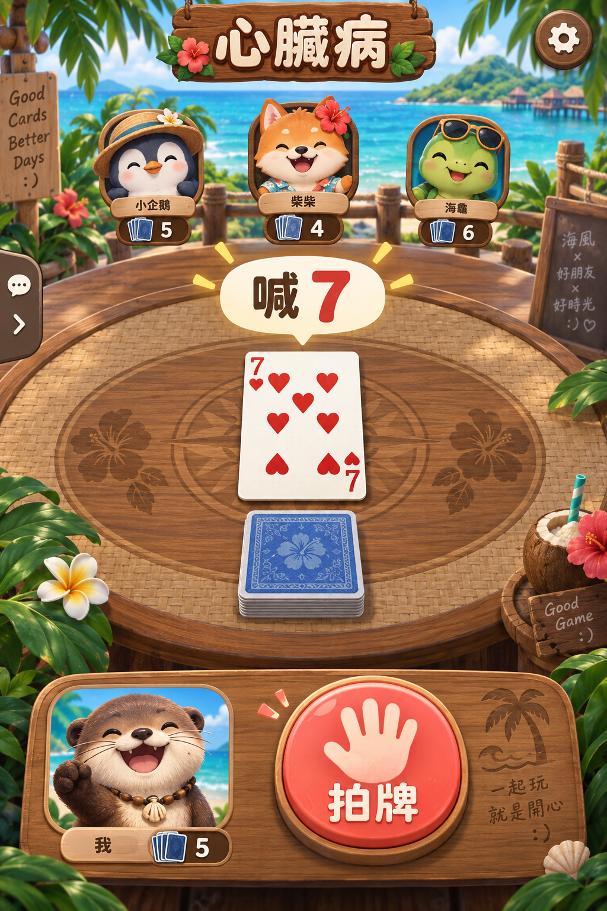

# 海島心臟病｜遊戲計畫書

## 1. 遊戲定位與已確認決定

以標準撲克牌「心臟病」為核心的可愛海島多人遊戲。系統決定玩家順序並輪流自動翻牌，同步依序喊 1、2、3……13（A＝1、J＝11、Q＝12、K＝13）；喊出的點數與翻出的牌相同時，所有人拍中央牌堆，**最後拍的人收下整疊**。拍錯的人也收下牌堆。每次收牌後自動發牌暫停，由收牌者啟動下一段。目標是先把自己的牌出完。

本計畫依照使用者已確認的選擇：

| 主題 | 決定 |
| --- | --- |
| 牌組 | 完整 52 張標準撲克牌，不含鬼牌 |
| 玩家順序與發牌 | 系統先決定本局的玩家順序；洗牌後依該順序輪流發完 52 張 |
| 啟動下一段 | 第一順位玩家喊「開始」；之後每次由最後拍、收牌的玩家按「自動發牌」 |
| 勝利 | 第一位在當次翻牌與拍牌判定完成後，手牌為 0 的玩家獲勝 |
| 模式 | 單人對 1～3 個電腦；線上 2–4 人，可由電腦補位；不做同機多人 |
| 線上拍牌 | 保留反應速度競爭，以**伺服器收到有效拍牌訊息的先後**判定；接受網路延遲影響 |
| 美術 | 可愛海島場景＋清楚可辨的標準撲克牌 |

**已確認（2026-09-24）**：每次收牌後，下一段一律**回到 1 重新喊**。人數 2～4 人；不做同一台裝置多人；電腦難度為四段（幼幼班／簡單／普通／困難）。

**局長限制**：52 張牌且有人收牌後會重新加入出牌循環，因此一局可能明顯超過數分鐘，無法保證短局。第一版不偷偷加入固定倒數或強制結算；開發時記錄實際對局時間，再決定是否另外提供「短局」選項。

## 2. 示意圖

### 四人線上牌桌（桌機／平板橫向構圖）

### 單人對 AI（手機直向構圖）

兩張圖是氣氛、資訊層級與操作位置的示意。正式遊戲要以 SVG／CSS 繪製文字、花色、牌面與按鈕，避免圖中文字錯誤，也讓不同螢幕能保持清晰。圖上出現的手牌數字不是正式發牌結果。

## 3. 詳細玩法

### 開局與發牌

1. 伺服器或單機規則核心建立 52 張牌，四種花色各有 A–K，無鬼牌。
2. 系統先隨機決定本局玩家順序，再洗牌並依此順序一人一張輪流發，直到發完。52 張無法平均分給 3 人時，按系統決定的順序發放多出的一張；下一局重新決定順序。每人只能看到自己的**剩餘張數**，不能預先看牌面或調整出牌順序。
3. 發完牌後，第一順位玩家看到「開始」按鈕；按下後由系統依固定節奏連續自動翻牌。其他玩家不能代按開始。
4. 牌堆與玩家手牌是各自的順序佇列；收牌時，將中央牌堆依翻出順序放到收牌者手牌底部，不重新洗亂。

### 翻牌與喊數

- 自動發牌啟動後，系統按預先決定的玩家順序，從當前玩家手牌頂端翻出一張到桌面中央；不需要每人逐張按牌。系統同時喊出目前數字；第一張喊 1，之後依序 2～13，再回到 1（A＝1、J＝11、Q＝12、K＝13）。花色不影響是否相同。
- 喊數在同一段連續發牌中，按**每次成功翻牌**遞增；每段開始（第一段與每次收牌後）都從 1 重新喊。
- 若點數不同，留約 1 秒給玩家辨識與可能的誤拍；確認無人達成零手牌勝利後，系統自動翻下一位有牌玩家的牌。沒有牌的玩家仍可參與拍牌，直到勝負判定完成。
- 若點數相同，自動發牌立即暫停並開啟約 2 秒拍牌窗口；每位玩家最多提交一次有效拍牌。全部拍完可提早結算。

### 收牌與勝負

- 點數相同時，最後拍到者收下整疊；有人未拍，未拍者視為比已拍者更慢。多名未拍者的處置需要可重現：從當次翻牌者往後的座位順序中，最後一名未拍者收牌。
- 點數不同卻拍牌，第一位被伺服器接受的誤拍者收下整疊。尚未翻牌時拍下的輸入不算有效動作，也不處罰。
- 收牌後暫停；由**剛剛收牌的玩家**看到「自動發牌」按鈕，按下後從該玩家開始下一段連續翻牌。若多人手牌為 0，只要中央牌堆尚待判定，必須先結算；結算完成後，若有人仍為 0，該玩家獲勝。極少數同時滿足時，以這次翻牌者為先，再依系統決定的玩家順序決定勝者。
- 離線／線上都使用相同牌序、喊數、拍牌與勝負規則。

### 節奏與離席

- 只有每段的啟動者需要按「開始」或「自動發牌」。若啟動者斷線或長時間無操作，顯示等待與代按倒數，逾時由系統啟動，避免房間卡住。每張牌的翻出節奏可調校，初稿以約 1 秒一張為基準；拍牌與收牌會暫停發牌。
- 玩家斷線時保留席位一段可設定的重連時間；進行中的自動翻牌不因單一玩家斷線而停止，拍牌窗口未輸入視為未拍。重連後取得最新公開狀態與自己的席位。
- 房主可在大廳設定房間人數與 AI 補位；對局中不讓觀戰者直接接手牌位。

## 4. 單人與 AI

單人對 1–3 名 AI，讓玩家選擇總人數與 AI 難度。AI 和玩家使用同一個合法行動入口；AI 只知道公開翻牌與喊數，不預讀未翻出的牌。

| 難度 | 拍牌表現（實作值） | 翻牌節奏 | 體感 |
| --- | --- | --- | --- |
| 幼幼班 | 反應 1.3～2.2 秒、18% 會發呆沒拍、從不誤拍 | 1.7 秒一張、拍牌窗 3.6 秒 | 3～5 歲小朋友也拍得到 |
| 簡單 | 0.75～1.3 秒，偶爾發呆，點數差 1 時容易看錯 | 1.4 秒一張 | 適合熟悉規則 |
| 普通 | 0.48～0.85 秒，很少出錯 | 1.15 秒一張 | 接近休閒玩家 |
| 困難 | 0.3～0.52 秒，幾乎不出錯，但仍是人類做得到的反應時間 | 0.95 秒一張 | 偏挑戰 |

教學做成靜態圖文說明頁（首頁「怎麼玩」），六個步驟配牌面插圖，看完可直接開始練習。單人模式可以暫停，線上模式只能開啟選單，不暫停全房間。

## 5. 線上房間與延遲設計

線上版由伺服器持有玩家順序、洗牌結果、每位玩家的未翻牌順序、中央牌堆、喊數、自動翻牌計時器、拍牌接收時間與勝負。用戶端僅傳送「開始／自動發牌」與「拍牌」意圖，不自行決定牌面、收牌人或勝者。翻出的牌與喊數由伺服器一次廣播給房內玩家與觀戰者；未翻出的牌不送到瀏覽器。

**已接受的限制**：以伺服器收到拍牌訊息的順序排名，網路較慢者可能比較晚被記錄，即使本人實際按得比較快。介面在進入線上房間前直接說明，並在遊戲中顯示目前連線狀態。不能把這種判定宣稱為跨網路的公平反應時間測量。可減少動畫與網路往返，仍無法消除延遲差異。

房間具備公開列表、建立／加入、玩家準備、觀戰、邀請連結、操作摘要與聊天。邀請連結先到大廳確認可編輯暱稱及角色，再進房。桌機與平板橫向的摘要、聊天室放在同一個左側欄位；手機直向以左側可收合面板開啟。觀戰者只看公開的牌面、玩家張數與對局記錄，不可翻牌或拍牌。至少一名真人玩家在線才保留房間；最後一名真人離開或逾重連期限後關閉房間並撤銷邀請。

網路中斷時顯示「重連中」，拍牌期間不替玩家補送舊動作，也不接受過期拍牌。每個拍牌訊息包含對局 ID、翻牌序號與一次性動作 ID；伺服器拒絕重複、越權及上一張牌的動作。免費服務可能休眠或重啟；第一版房間是暫時狀態，不承諾服務重啟後恢復未完對局。

## 6. 介面與美術

| 裝置 | 主要呈現 |
| --- | --- |
| 桌機 | 中央牌桌最大化，四名玩家圍桌；左側摘要在上、聊天室在下；右上設定 |
| 平板橫向 | 保留圍桌位置，縮窄左欄；玩家張數使用圓角徽章 |
| 平板直向 | 玩家圍在中央牌桌上方與兩側；底部固定大拍牌鈕；資訊欄改為可收合面板 |
| 手機直向 | 上方玩家列，中間大牌面與喊數，下方個人張數、開始／自動發牌按鈕及拍牌區；資訊從左側展開 |
| 手機橫向 | 中央保留清楚的喊數與牌面；玩家列表改側邊列，拍牌鈕靠近右手拇指 |

「開始／自動發牌」只對本段啟動者顯示；「拍牌」在牌面翻出後可按，且匹配與不匹配時外觀相同，避免畫面直接洩漏答案。鍵盤可用 Enter 啟動發牌、Space 拍牌。觸控按鈕至少 48×48 CSS px，拍牌鈕更大；使用一般語意化按鈕配合自訂立體樣式。紅色花色與黑色花色還要有清楚符號，不只靠顏色區分。

設定按鈕固定於右上安全區，開啟彈窗調整音樂、音效、震動與減少動態。翻牌音效不應比牌面更早提示結果。勝負以保留牌桌的疊加層顯示，提供「再來一局」「回到房間」「回到首頁」。

## 7. 實作現況（2026-09-24）

單機與線上都已可完整遊玩，沿用其他小遊戲的零依賴架構（Node 內建 http ＋自寫 `lib/ws.js` WebSocket，雙擊 `啟動遊戲.bat` 就能玩，本機 port 3080）。

| 檔案 | 內容 |
| --- | --- |
| `public/js/rules.js` | 規則狀態機（發牌、自動翻牌、喊數、拍牌判定、收牌、勝負、publicView），瀏覽器與伺服器共用 |
| `public/js/ai.js` | 四段電腦與驅動器，跟真人走同一個 `Rules.start / Rules.slap` 入口 |
| `public/js/rng.js` | 可注入 seed 的亂數（洗牌、電腦反應） |
| `public/js/art.js` | 全手繪 SVG：52 張撲克牌（大字角標、標準配色：紅心方塊紅、黑桃梅花黑）、牌背、八隻海島動物、圖示 |
| `public/js/table.js` | 牌桌畫面（單機與線上共用，只吃公開狀態） |
| `public/js/solo.js` | 單機：可暫停的遊戲時鐘 |
| `public/js/net.js`、`online.js` | 連線、喚醒冷啟動伺服器、大廳、房間、觀戰、邀請、線上對局 |
| `public/js/config.js` | 唯一的 server URL 入口（`GAME_SERVER_URL` 建置時注入） |
| `lib/rooms.js` | 房間、席位、觀戰、邀請、聊天、權威對局 |
| `server.js` | HTTP、`/health`、`/api/presence`、WebSocket 分派與廣播 |

**實作時補上的決定**（可再調整）：線上啟動者 8 秒沒按由系統代按；斷線保留座位 30 秒，超過由「普通」電腦代打、回來就還給本人；對局中主動離開也由電腦代打到這局結束；觀戰席上限 20 人、觀戰者可聊天；房主可加／移除電腦、改人數上限與節奏、踢人（5 分鐘內不能再進）、撤銷或重發邀請連結；邀請連結與房間同生命。

**結束方式（2026-09-24 追加）**：線上由房主在房間設定選、單機開局前選，預設①。
① 有人出完就結束：第一個出完（判定都結束後仍 0 張）的人獲勝，其他人照剩餘張數排名。
② 打到只剩一人有牌：出完的人依序拿到名次並離開牌桌（不能再拍、也不會被算成沒拍到），其他人繼續打；只剩一人有牌時結束，他是最後一名。這個模式一局明顯較長（電腦 4 人模擬中位數約 3 分鐘、最長可到 10 分鐘以上）。

**喊數語音（2026-09-24 追加）**：翻牌時一定念出數字，一律喊 1～13（一、二……十三），不喊 A、J、Q、K；牌面仍是標準撲克牌，A＝1、J＝11、Q＝12、K＝13。喊數泡泡與紀錄也都顯示數字。內建 13 段錄音（espeak-ng 離線合成、調高音調）跟翻牌同一瞬間播出；裝置有中文語音時預設改用裝置語音（較自然），沒有或出錯就退回內建錄音。設定可切換「自動／遊戲內建／裝置語音」並試聽。

**驗證**：`npm run verify` ＝ 31 項規則／電腦測試（含兩種結束方式）（含 80 局電腦互打全程 52 張守恆）＋ 50 項線上測試（真連線走完房間生命週期＋假時鐘快轉整局）＋ 39 項無頭瀏覽器檢查（含喊數錄音解碼、每翻一張就喊一次）（五種尺寸版面、設定彈窗、單機打到結算、線上邀請／觀戰／聊天），截圖在 `screenshots/`。
